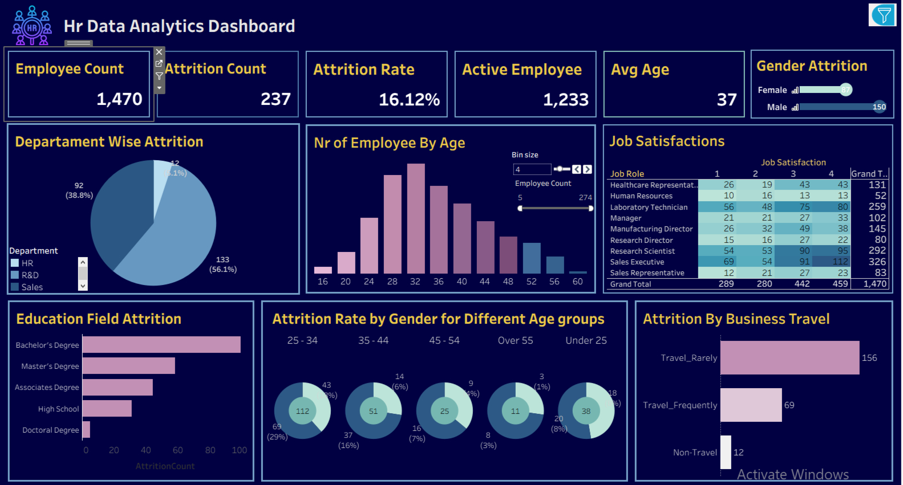

# HR Analytics Dashboard

## 📊 Project Overview

This project presents an HR Analytics Dashboard developed using Tableau.

The dashboard explores employee data and provides insights into employee
attrition, demographics, departments, job roles, and business travel.

## 🛠 Tools & Technologies

- Tableau
- Excel
- Data Visualization
- Calculated Fields
- Parameters
- Filters
- Dashboard Actions

## 📈 Key Analysis

The dashboard analyzes:

- Employee Attrition
- Attrition by Department
- Attrition by Gender
- Attrition by Age
- Attrition by Business Travel
- Employee Demographics
- Job Roles
- Employee Distribution

## 🎯 Project Objective

The main objective of this project is to analyze HR data and identify
patterns related to employee attrition and employee characteristics.

## 📷 Dashboard Preview

## 🔗 Tableau Public

[View Interactive Dashboard](https://public.tableau.com/app/profile/tanzile.gasimova/))

## 📁 Project Files

- `HR_Analytics_Dashboard.twbx` — Tableau workbook
- `images/dashboard.png` — Dashboard preview
